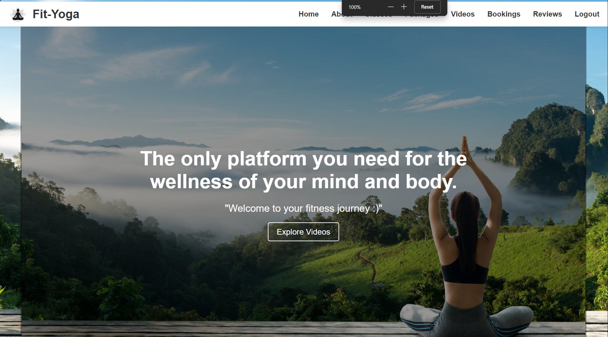
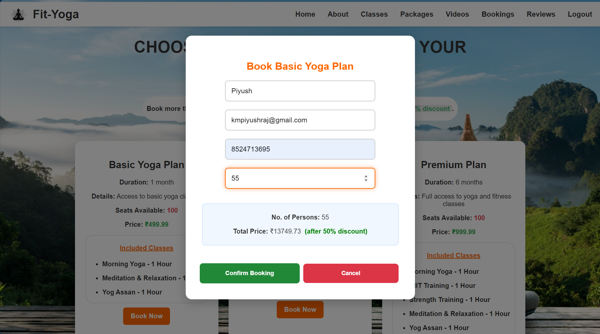
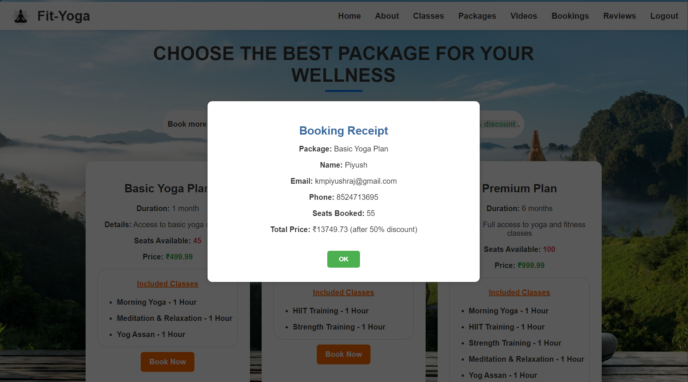
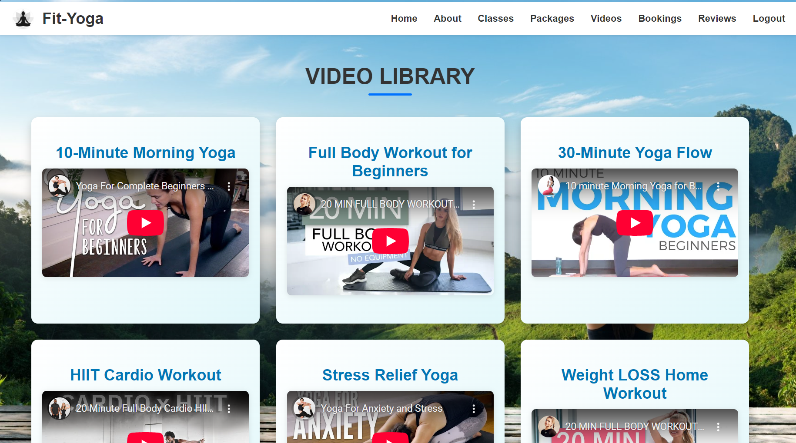
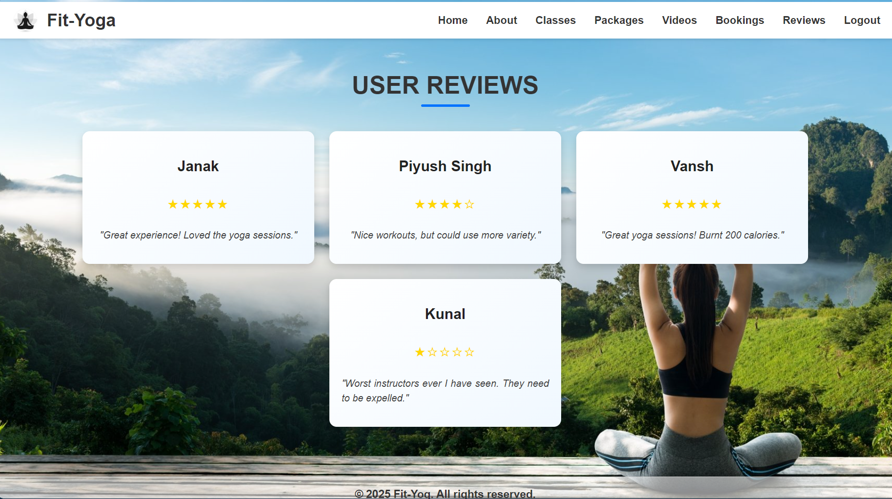
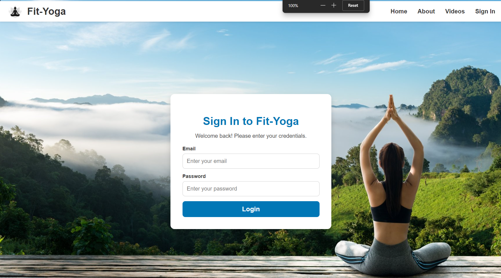
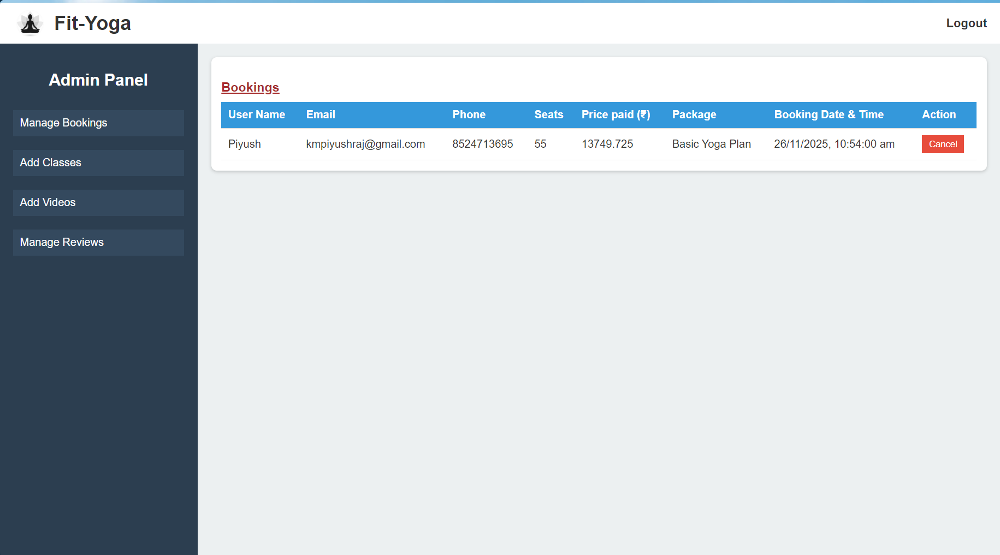
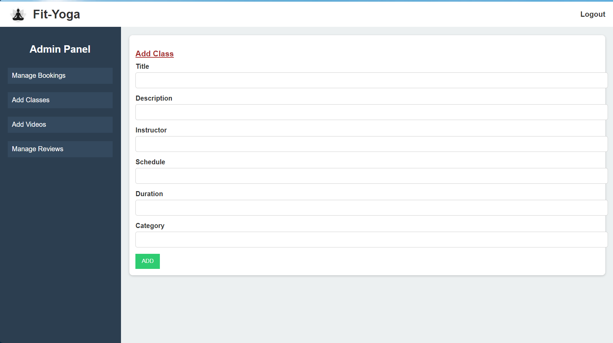
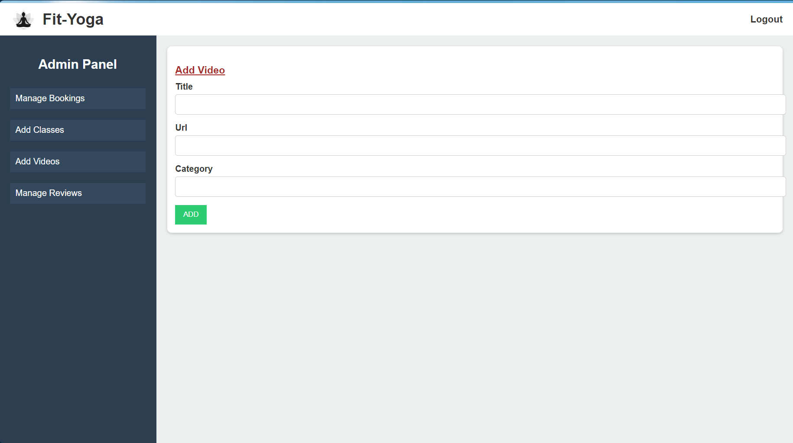
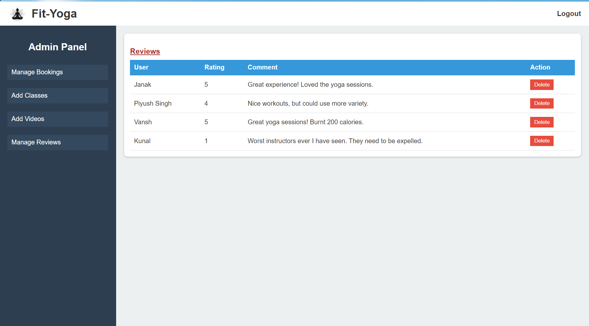

# Fit-Yoga: Online Fitness and Yoga Application


A comprehensive web-based **Fitness and Yoga Booking and Content Management System** designed to streamline class bookings, content management, and user engagement. Built with the **MERN stack** (MongoDB, Express.js, React.js, Node.js), this platform bridges the gap between traditional yoga practices and modern digital convenience.

---

## 📋 Table of Contents

- [Overview](#overview)
- [Features](#features)
- [Tech Stack](#tech-stack)
- [System Architecture](#system-architecture)
- [Installation](#installation)
- [Configuration](#configuration)
- [Usage](#usage)
- [Screenshots](#screenshots)
- [API Endpoints](#api-endpoints)
- [Future Enhancements](#future-enhancements)
- [Contributors](#contributors)

---

## 🌟 Overview

**Fit-Yoga** is a full-stack web application that provides:
- **Users**: Easy registration, package browsing, class booking with dynamic seat availability, video tutorials, and review submissions
- **Admins**: A powerful dashboard to manage bookings, add classes/videos, and moderate reviews

The platform automates essential wellness service tasks, reducing manual workload while enhancing user experience through features like automatic discount calculations, booking receipts, and real-time seat tracking.

---

## ✨ Features

### User Features
- 🔐 **Authentication System**: Secure registration and login
- 📦 **Package Browsing**: View detailed fitness and yoga packages with pricing
- 🎟️ **Smart Booking System**: 
  - Real-time seat availability tracking
  - Automatic discount application (20% for 20+ seats, 50% for 50+ seats)
  - Instant booking confirmation and receipt generation
- 📚 **Class Listings**: Browse available yoga and fitness classes
- 🎥 **Video Library**: Access instructional videos and tutorials
- 📖 **Booking History**: Track all your bookings in one place
- ⭐ **Reviews**: Read feedback from other users

### Admin Features
- 📊 **Booking Management**: View and cancel user bookings
- ➕ **Content Management**: Add new classes and video tutorials
- 🗑️ **Review Moderation**: Manage user reviews for quality control
- 👥 **User Oversight**: Monitor booking patterns and seat availability

### Technical Highlights
- 🔄 **Session Management**: Secure user sessions with express-session
- 🎨 **Responsive Design**: Mobile-friendly interface with smooth animations
- 🚀 **RESTful API**: Clean backend architecture
- 💾 **MongoDB Integration**: Efficient NoSQL database operations with Mongoose ODM
- 🔒 **Role-Based Access**: Separate user and admin functionalities

---

## 🛠️ Tech Stack

### Frontend
- **React.js** - Component-based UI library
- **React Router** - Client-side routing
- **Axios** - HTTP client for API requests
- **Framer Motion** - Animation library
- **CSS3** - Custom styling with animations

### Backend
- **Node.js** - JavaScript runtime environment
- **Express.js** - Web application framework
- **MongoDB** - NoSQL database
- **Mongoose** - MongoDB object modeling
- **express-session** - Session middleware
- **CORS** - Cross-origin resource sharing

### Development Tools
- **Visual Studio Code** - Code editor
- **MongoDB Compass** - Database management GUI
- **dotenv** - Environment variable management

---

## 🏗️ System Architecture

```
┌─────────────────┐
│   React Client  │
│   (Port 3000)   │
└────────┬────────┘
         │
         │ HTTP/REST API
         │
┌────────▼────────┐
│  Express Server │
│   (Port 5000)   │
└────────┬────────┘
         │
         │ Mongoose ODM
         │
┌────────▼────────┐
│    MongoDB      │
│    Database     │
└─────────────────┘
```

### Database Schema

**Collections:**
- `users` - User credentials and roles
- `classes` - Fitness and yoga class details
- `packages` - Booking packages with pricing and availability
- `bookings` - User booking records
- `videos` - Tutorial video information
- `reviews` - User feedback and ratings

---

## 📥 Installation

### Prerequisites
- Node.js (v14 or higher)
- MongoDB (v4 or higher)
- npm or yarn package manager

### Step 1: Clone the Repository
```bash
git clone https://github.com/kumarpiyushraj/Fit-Yoga.git
cd fit-yoga
```

### Step 2: Install Backend Dependencies
```bash
cd backend
npm install
```

**Required packages:**
```json
{
  "express": "^4.18.0",
  "mongoose": "^6.0.0",
  "cors": "^2.8.5",
  "express-session": "^1.17.0",
  "dotenv": "^16.0.0"
}
```

### Step 3: Install Frontend Dependencies
```bash
cd ../frontend
npm install
```

**Required packages:**
```json
{
  "react": "^18.2.0",
  "react-dom": "^18.2.0",
  "react-router-dom": "^6.0.0",
  "axios": "^1.0.0",
  "framer-motion": "^10.0.0"
}
```

### Step 4: Setup MongoDB
Ensure MongoDB is running locally or use a cloud instance (MongoDB Atlas).

---

## ⚙️ Configuration

### Backend Configuration

Create a `.env` file in the `backend` directory:

```env
# MongoDB Connection
MONGO_URI=mongodb://localhost:27017/FitnessYogaApp

# Session Secret
SESSION_SECRET=G8#j2Lr@9vPqXz$MnT3yB!dK

# Server Port
PORT=5000
```

### Frontend Configuration

Update API endpoints in your components if needed (default: `http://localhost:5000`).

---

## 🚀 Usage

### Running the Application

**Terminal 1 - Start Backend Server:**
```bash
cd backend
node server.js
# Server running on http://localhost:5000
```

**Terminal 2 - Start Frontend:**
```bash
cd frontend
npm start
# React app running on http://localhost:3000
```

### Default Admin Credentials
You'll need to manually create an admin user in MongoDB with `role: "admin"`.

### User Workflow
1. **Register** → Create a new account
2. **Login** → Access user dashboard
3. **Browse** → Explore classes, packages, and videos
4. **Book** → Select a package and complete booking
5. **Track** → View booking history
6. **Review** → Read user feedback

### Admin Workflow
1. **Login** → Access admin dashboard
2. **Manage** → View and cancel bookings
3. **Add Content** → Create new classes and upload videos
4. **Moderate** → Review and delete inappropriate reviews

---

## 📸 Application Screenshots

<div align="center">

<!-- Feature Banner -->
### 🌟 Key Features Overview

</div>

---

### 🎯 User Experience

<div align="center">

<table>
<tr><td>

#### 🏠 Homepage - Your Wellness Journey Starts Here


**Features:** Clean interface • Intuitive navigation • Call-to-action buttons

</td></tr>
<tr><td>

#### 📦 Package Selection - Find Your Perfect Fit


**Features:** Detailed pricing • Real-time seat availability • Auto discounts (20%/50%)

</td></tr>
<tr><td>

#### 🎟️ Smart Booking System


**Features:** Instant price calculation • Seat validation • Pre-filled user data

</td></tr>
<tr><td>

#### 🧾 Booking Confirmation


**Features:** Complete booking details • Applied discounts • Receipt generation

</td></tr>
<tr><td>

#### 👤 Personal Dashboard


**Features:** Booking history • Date & time tracking • Pricing details

</td></tr>
<tr><td>

#### 🎥 Video Library


**Features:** Embedded videos • Category filtering • Tutorial access

</td></tr>
<tr><td>

#### ⭐ Community Reviews


**Features:** Star ratings • User testimonials • Feedback display

</td></tr>
</table>

</div>

---

### 🔐 Authentication System

<div align="center">

<table>
<tr>
<td width="50%">

#### User Sign In


✅ Secure login  
✅ Session management  
✅ Role-based access

</td>
<td width="50%">

#### User Registration


✅ Form validation  
✅ Pattern matching  
✅ Error handling

</td>
</tr>
</table>

</div>

---

### 🛡️ Administrative Control Panel

<div align="center">

<table>
<tr><td>

#### Main Dashboard - Command Center


**Capabilities:** Booking overview • User management • Content control • Analytics

</td></tr>
<tr><td>

#### Class Management


**Functions:** Create classes • Set schedules • Assign instructors • Define categories

</td></tr>
<tr><td>

#### Video Content Management


**Functions:** Upload tutorials • Categorize content • Manage library

</td></tr>
<tr><td>

#### Review Moderation


**Functions:** View all reviews • Delete inappropriate content • Quality control

</td></tr>
</table>

</div>

---

<div align="center">

### 💡 What Makes Our Interface Special?

| Feature | Description |
|:-------:|:------------|
| 🎨 **Modern Design** | Clean, responsive UI with smooth animations |
| 🚀 **Fast Performance** | Optimized loading and real-time updates |
| 📱 **Mobile Friendly** | Fully responsive across all devices |
| 🔒 **Secure** | Session-based authentication with role management |
| ♿ **Accessible** | User-friendly for all skill levels |

</div>

---

## 🔌 API Endpoints

### Authentication
| Method | Endpoint | Description |
|--------|----------|-------------|
| POST | `/api/register` | Register new user |
| POST | `/api/login` | User/Admin login |
| POST | `/api/logout` | Logout user |
| GET | `/api/currentUser` | Get session user |

### User Endpoints
| Method | Endpoint | Description |
|--------|----------|-------------|
| GET | `/api/classes` | Fetch all classes |
| GET | `/api/packages` | Fetch all packages |
| GET | `/api/videos` | Fetch all videos |
| GET | `/api/reviews` | Fetch all reviews |
| POST | `/api/bookings` | Create new booking |
| GET | `/api/userbookings` | Fetch user's bookings |

### Admin Endpoints (Protected)
| Method | Endpoint | Description |
|--------|----------|-------------|
| GET | `/api/admin/bookings` | View all bookings |
| DELETE | `/api/bookings/:id` | Cancel booking |
| POST | `/api/admin/classes` | Add new class |
| POST | `/api/admin/videos` | Add new video |
| GET | `/api/admin/reviews` | View all reviews |
| DELETE | `/api/admin/reviews/:id` | Delete review |

---

## 🔮 Future Enhancements

- 💳 **Payment Gateway Integration** - Secure online payment processing
- 📱 **Mobile Application** - Native iOS and Android apps
- 🎬 **Live Streaming** - Real-time class broadcasting
- 🤖 **AI Recommendations** - Personalized fitness plans
- 📊 **Analytics Dashboard** - User engagement metrics
- 🌐 **Multi-language Support** - International accessibility
- ⌚ **Wearable Integration** - Connect with fitness trackers
- 🔔 **Push Notifications** - Class reminders and updates
- 📧 **Email Confirmations** - Automated booking receipts
- 🔐 **Password Encryption** - bcrypt implementation
- 📈 **Progress Tracking** - User fitness journey monitoring

---

## 👥 Contributors

This project was developed as part of **PMCA601L – Full Stack Web Development** at VIT, Vellore.

| Name | Roll Number |
|------|-------------|
| Kumar Piyush Raj | 24MCA0136 |
| Kunal Purohit | 24MCA0185 |
| Vansh Jain | 24MCA0131 |
| Janak | 24MCA0145 |

**Project Guide:** Prof. Senthil Murugan B  
**Department:** Computer Applications  
**School:** Computer Science Engineering and Information Systems  
**Institution:** VIT, Vellore

---

## 🙏 Acknowledgments

- VIT, Vellore for academic support
- Prof. Senthil Murugan B for project guidance
- The MERN stack community for excellent documentation
- All contributors who helped shape this project

---

<div align="center">

**Made with ❤️ by Team Fit-Yoga**

⭐ Star this repository if you found it helpful!

<p align="center">
  <sub>© 2025 Kumar Piyush Raj. All rights reserved.</sub>
</p>

</div>
